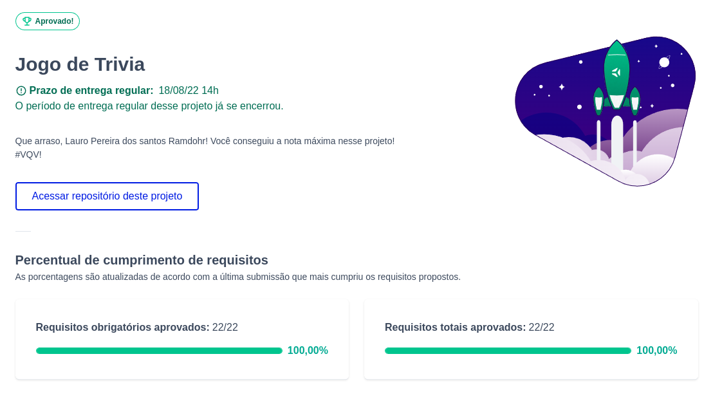

# :game_die: Trivia

## Acesse meu projeto <a href="https://lauropera.github.io/trivia/">AQUI</a>

## :satellite: Desenvolvimento

Projeto desenvolvido por <a href="https://www.linkedin.com/in/lauro-pereira-sr/" target="_blank">Lauro Pereira</a>, <a href="https://www.linkedin.com/in/mrkdavi/" target="_blank">Marcus Queiros</a>, <a href="https://www.linkedin.com/in/rsajoao/" target="_blank">João Sousa</a>, <a href="https://www.linkedin.com/in/daniel-gomes-645096226/" target="_blank">Daniel Gomes</a> e <a href="https://github.com/gabriel-user" target="_blank">Gabriel Vinicíus</a> na <a href="https://betrybe.com/" target="_blank">Trybe</a> durante o módulo de Front-End!

Nesse projeto em grupo desenvolvemos uma aplicação de um jogo Trivia, de perguntas e respostas. Colocamos em prática o Redux, ferramenta que nos permite passar informações de uma página para outra sem dificuldades e trabalhar com a API do Trivia.

## :hammer_and_wrench: Tecnologias

* HTML
* CSS
* JavaScript
* React.js
* Redux

# :camera: Screenshots

## :heavy_check_mark: Nota

