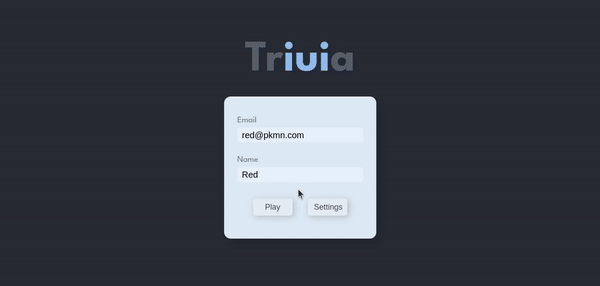
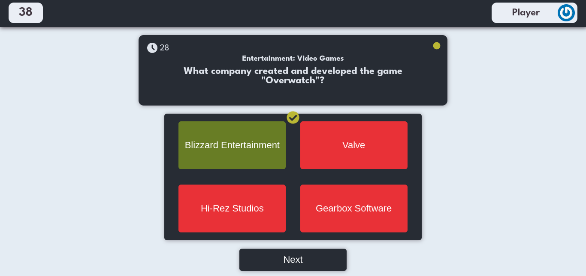
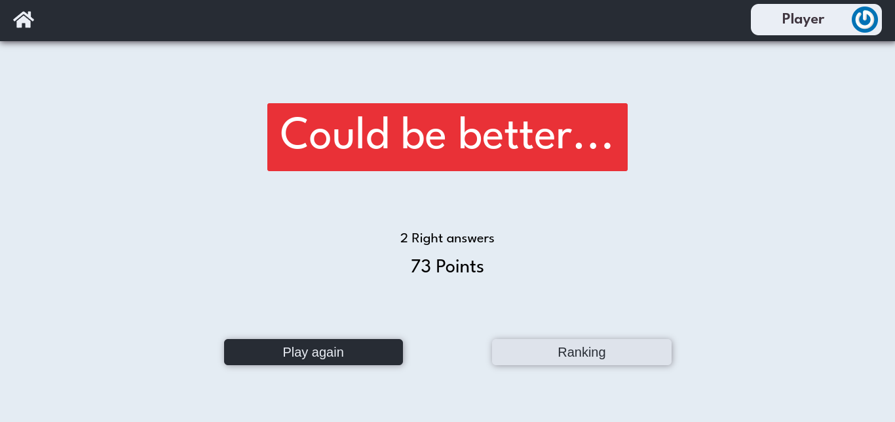
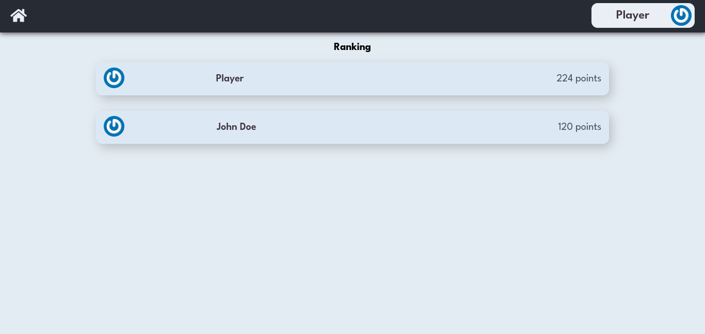

# 🕹️ Trivia



## Acesse o projeto clicando <a href="https://lauropera.github.io/trivia/">AQUI</a>

<br />

## 📡 Desenvolvimento

Projeto desenvolvido por <a href="https://www.linkedin.com/in/lauro-pereira-sr/" target="_blank">Lauro Pereira</a>, <a href="https://www.linkedin.com/in/daniel-gomes-645096226/" target="_blank">Daniel Gomes</a>, <a href="https://www.linkedin.com/in/gabrielvinicius-es/" target="_blank">Gabriel Vinicíus</a>, <a href="https://www.linkedin.com/in/mrkdavi/" target="_blank">Marcus Queiros</a> e <a href="https://www.linkedin.com/in/rsajoao/" target="_blank">João Sousa</a> na <a href="https://betrybe.com/" target="_blank">Trybe</a> durante o módulo de Front-End!

Nesse projeto em grupo desenvolvemos uma aplicação de um jogo Trivia, de perguntas e respostas. Colocamos em prática o Redux, ferramenta que nos permite passar informações de uma página para outra sem dificuldades e trabalhar com a API do Trivia.

<br />

## ⚙️ Tecnologias

* HTML
* CSS
* JavaScript
* React.js
* Redux

<br />

## 📚 Documentação

  <details>
    <summary>Instalação e execução</summary>
    <br />

* Faça o fork do repositório:
      Tutorial [AQUI](https://github.com/UNIVALI-LITE/Portugol-Studio/wiki/Fazendo-um-Fork-do-reposit%C3%B3rio)
* Abra seu terminal e navegue até a pasta onde preferir alocar o projeto.

* Clone o repositório:

    ```sh
      git clone git@github.com:"SeuNomeNoGitHub"/trivia.git
    ```

* Apos ter o repositório clonado em sua maquina, execute este comando para acessar a parta do projeto:

    ```sh
      cd trivia
    ```

* Dentro da pasta do projeto, execute o comando abaixo para instalar as dependências do projeto:

    Caso utilize o npm:

    ```sh
      npm install
    ```

    Caso utilize o yarn:

    ```sh
      yarn install
    ```

* Dentro da pasta do projeto, execute o comando abaixo para iniciar o servidor do projeto:

    Caso utilize o npm:

    ```sh
      npm start
    ```

    Caso utilize o yarn:

    ```sh
      yarn start
    ```

  O aplicativo sera executado em modo de desenvolvimento.
  Abrindo na porta padrão que o React usa: <http://localhost:3000/> em seu navegador.

  </details>
<br />

## 👥 Equipe

<br />
<table>
  <tr>
      <td align="center">
      <a href="https://github.com/DanielGomesTB">
        <br>
        <sub>
          <b>Daniel Gomes</b>
        </sub>
      </a>
    </td>
      <td align="center">
      <a href="https://github.com/gabriel-user">
        <br>
        <sub>
          <b>Gabriel Vinicíus</b>
        </sub>
      </a>
    </td>
        <td align="center">
      <a href="https://github.com/rsajoao">
        <br>
        <sub>
          <b>João Sousa</b>
        </sub>
      </a>
    </td>
    <td align="center">
      <a href="https://github.com/lauropera">
        <br>
        <sub>
          <b>Lauro Pereira</b>
        </sub>
      </a>
    </td>
    <td align="center">
      <a href="https://github.com/mrkdavi">
        <br>
        <sub>
          <b>Marcus Queiros</b>
        </sub>
      </a>
    </td>
  </tr>
</table>

<br />

# 📷 Screenshots





#

<div style="display:flex;justify-content:center;width:100%;">
  <p style="font-size:2rem;">🍐</p>
</div>